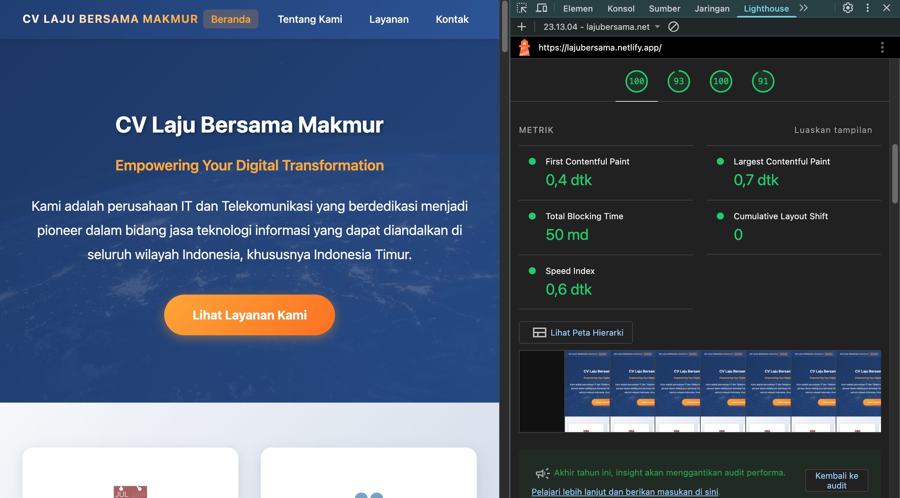
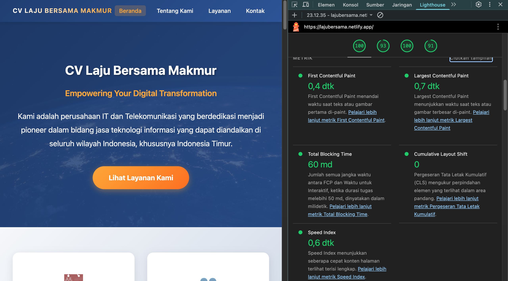
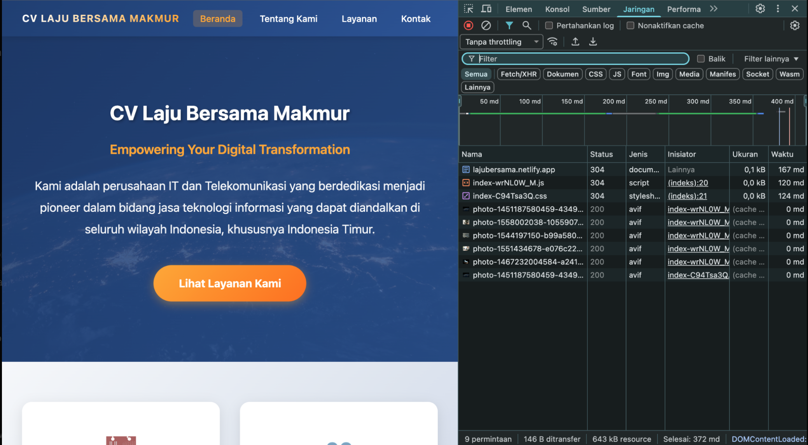
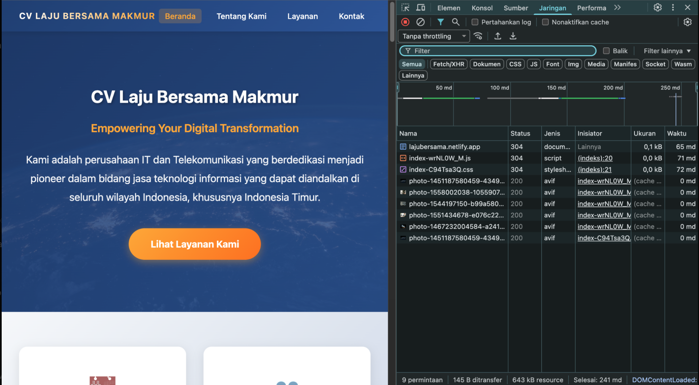
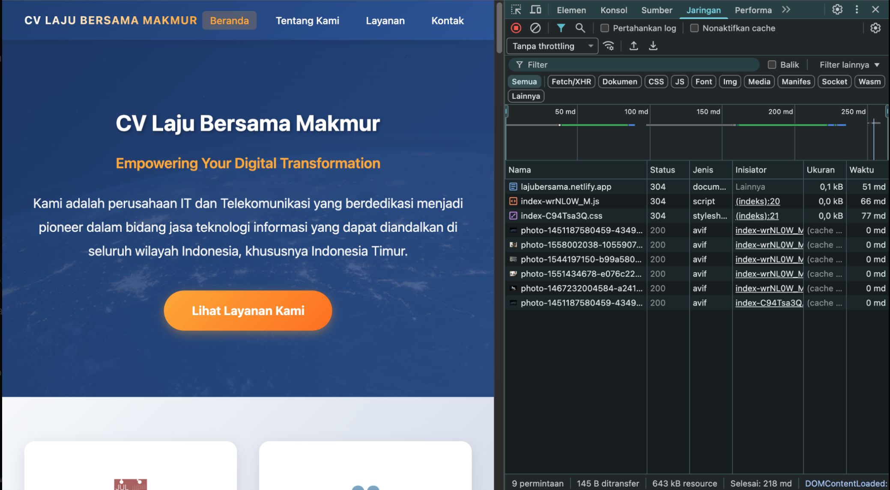
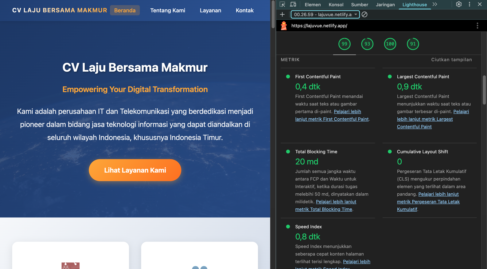
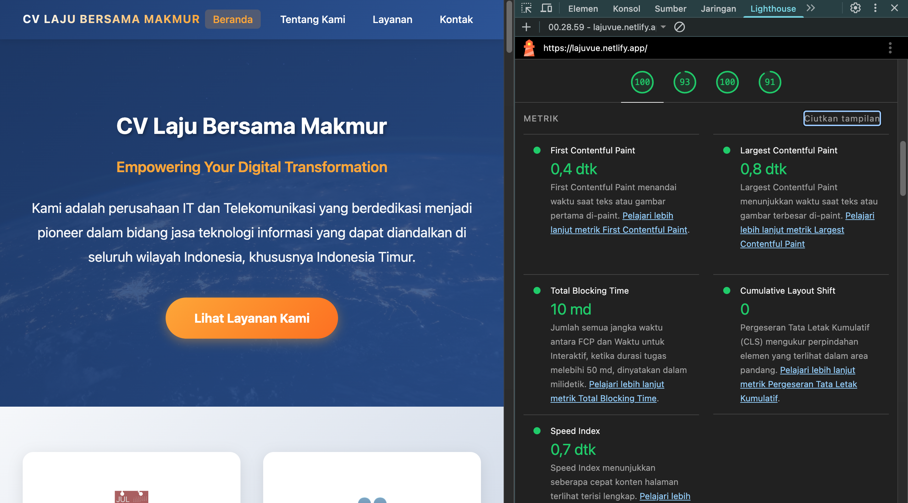
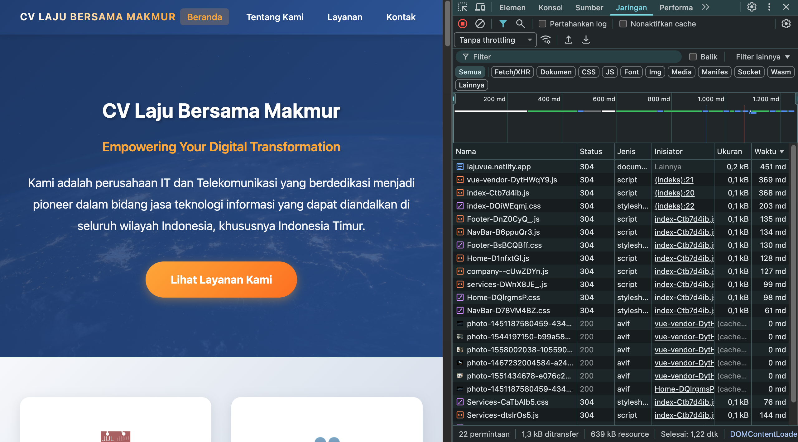
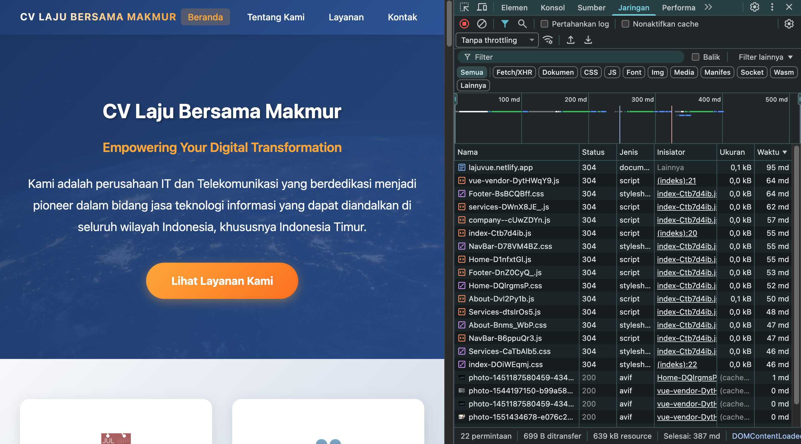
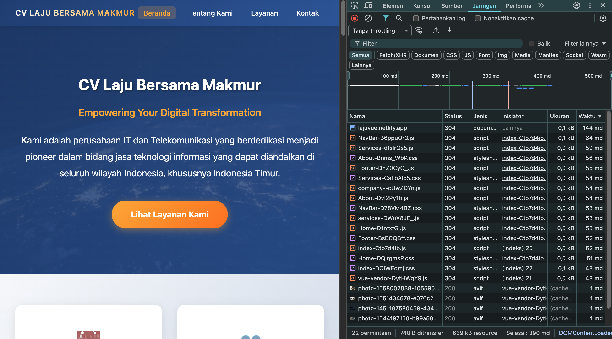

# Perbandingan Performa Aplikasi 1A (Baseline) dan 1B (Optimized)

## 1. Hasil Pengujian Performa

### 1.1 Pengujian Aplikasi 1A (Baseline)

#### 1.1.1 Pengujian Lighthouse

**Screenshot Hasil Pengujian (5 iterasi)**

| Pengujian | Screenshot |
|-----------|------------|
| Test 1 |  |
| Test 2 |  |
| Test 3 |  |
| Test 4 |  |
| Test 5 |  |

**Tabel Hasil Metrik Lighthouse**

| Test | FCP | LCP | TTI | TBT | CLS |
|------|------|------|------|------|------|
| 1 | 0.4 detik | 0.7 detik | 0.4 detik | 50 ms | 0 |
| 2 | 0.4 detik | 0.7 detik | 0.4 detik | 60 ms | 0 |
| 3 | 0.4 detik | 0.7 detik | 0.4 detik | 70 ms | 0 |
| 4 | 0.4 detik | 0.7 detik | 0.4 detik | 0 ms | 0 |
| 5 | 0.3 detik | 0.7 detik | 0.4 detik | 30 ms | 0 |

**Analisis Hasil**

Berdasarkan pengujian Lighthouse, aplikasi 1A menunjukkan performa yang cukup baik dengan nilai FCP berkisar antara 0.3–0.4 detik, mengindikasikan tampilan awal yang muncul dengan cepat. Nilai LCP konsisten pada 0.7 detik menunjukkan elemen konten terbesar dapat ditampilkan dalam waktu yang relatif singkat. TTI yang stabil pada 0.4 detik mengindikasikan aplikasi siap untuk berinteraksi dengan pengguna dalam waktu yang cepat. TBT berada pada rentang 0–70 ms, menandakan beban JavaScript yang cukup ringan. Nilai CLS yang konsisten pada 0 menunjukkan tidak terjadi pergeseran layout selama proses rendering.

Namun perlu dicatat bahwa meskipun metrik Lighthouse menunjukkan performa yang baik, aplikasi 1A masih memuat seluruh komponen secara penuh tanpa mengimplementasikan optimasi modern seperti lazy loading atau code splitting.

#### 1.1.2 Pengujian Jaringan 4G

**Screenshot Hasil Pengujian**

| Pengujian | Screenshot |
|-----------|------------|
| Test 1 |  |
| Test 2 |  |
| Test 3 |  |
| Test 4 |  |
| Test 5 |  |

**Tabel Time to First Byte (TTFB)**

| Pengujian | TTFB (ms) |
|-----------|-----------|
| Test 1 | ~520 |
| Test 2 | ~345 |
| Test 3 | ~221 |
| Test 4 | ~218 |
| Test 5 | ~194 |

**Analisis Hasil**

Pada kondisi jaringan 4G, aplikasi 1A menunjukkan nilai TTFB yang bervariasi dalam rentang 194–520 ms. Nilai ini tergolong tinggi dan mengindikasikan respons server yang lambat dalam kondisi jaringan yang tidak optimal. Karena aplikasi 1A tidak mengimplementasikan lazy loading, beban pada saat initial load menjadi cukup berat. Hal ini berdampak signifikan pada pengalaman pengguna mobile, dimana waktu yang dibutuhkan untuk membuka halaman pertama terasa lebih lama.

Variasi nilai TTFB yang cukup besar menunjukkan ketidakstabilan performa pada kondisi jaringan 4G, yang merupakan kelemahan utama dari aplikasi 1A.

#### 1.1.3 Pengujian Jaringan WiFi

**Screenshot Hasil Pengujian**

| Pengujian | Screenshot |
|-----------|------------|
| Test 1 |  |
| Test 2 |  |
| Test 3 |  |
| Test 4 |  |
| Test 5 |  |

**Tabel Time to First Byte (TTFB)**

| Pengujian | TTFB (ms) |
|-----------|-----------|
| Test 1 | ~65 |
| Test 2 | ~260 |
| Test 3 | ~65 |
| Test 4 | ~51 |
| Test 5 | ~114 |

**Analisis Hasil**

Pada kondisi jaringan WiFi, aplikasi 1A menunjukkan performa yang jauh lebih baik dengan nilai TTFB berkisar antara 51–65 ms (kecuali pada Test 2 yang mencapai 260 ms). Kecepatan jaringan WiFi yang lebih stabil berhasil menutupi kelemahan arsitektur aplikasi 1A yang memuat seluruh bundle secara penuh. Hasil ini mengindikasikan bahwa pada kondisi jaringan yang optimal, beban initial load tidak terlalu terasa oleh pengguna.

**Ringkasan Performa Aplikasi 1A**

| Aspek | Hasil | Keterangan |
|-------|-------|------------|
| Lighthouse | Baik | Metrik stabil dan cepat |
| Jaringan 4G | Kurang optimal | TTFB tinggi dan tidak stabil |
| Jaringan WiFi | Baik | Performa cepat dan stabil |
| Arsitektur | Konvensional | Tanpa lazy loading dan code splitting |

Aplikasi 1A mampu bekerja dengan baik pada kondisi jaringan yang stabil, namun kurang optimal dan tidak scalable karena masih menggunakan arsitektur konvensional tanpa optimasi modern.

---

### 1.2 Pengujian Aplikasi 1B (Optimized)

#### 1.2.1 Pengujian Lighthouse

**Screenshot Hasil Pengujian (5 iterasi)**

| Pengujian | Screenshot |
|-----------|------------|
| Test 1 |  |
| Test 2 |  |
| Test 3 |  |
| Test 4 |  |
| Test 5 |  |

**Tabel Hasil Metrik Lighthouse**

| Test | FCP (detik) | LCP (detik) | TBT (ms) | Speed Index (detik) | CLS |
|------|-------------|-------------|----------|----------------------|------|
| 1 | 0.4 | 0.9 | 20 | 0.8 | 0 |
| 2 | 0.4 | 0.8 | 40 | 0.7 | 0 |
| 3 | 0.4 | 0.8 | 10 | 0.7 | 0 |
| 4 | 0.4 | 0.8 | 10 | 0.7 | 0 |
| 5 | 0.4 | 0.8 | 0 | 1.1 | 0 |

**Analisis Hasil**

Aplikasi 1B menunjukkan performa yang konsisten dengan nilai FCP stabil pada 0.4 detik. Nilai LCP berada pada rentang 0.8–0.9 detik, yang masih tergolong sangat baik untuk halaman dengan komponen gambar. TBT yang sangat rendah (0–40 ms) mengindikasikan keberhasilan implementasi code-splitting dan lazy loading dalam mengurangi blocking time. Speed Index rata-rata 0.7–0.8 detik menunjukkan halaman dapat terlihat lengkap dengan cepat. Nilai CLS yang konsisten pada 0 mengindikasikan tidak terjadi pergeseran layout.

Implementasi optimasi seperti lazy loading, dynamic import, dan manual chunking berhasil meningkatkan stabilitas performa rendering dan interaktivitas aplikasi.

#### 1.2.2 Pengujian Jaringan 4G

**Screenshot Hasil Pengujian**

| Pengujian | Screenshot |
|-----------|------------|
| Test 1 |  |
| Test 2 |  |
| Test 3 |  |
| Test 4 |  |
| Test 5 |  |

**Tabel Time to First Byte (TTFB)**

| Pengujian | TTFB (ms) |
|-----------|-----------|
| Test 1 | ~131 | 
| Test 2 | ~94 |
| Test 3 | ~144 | 
| Test 4 | ~341 | 
| Test 5 | ~451 | 

**Analisis Hasil**

Pada kondisi jaringan 4G, aplikasi 1B menunjukkan nilai TTFB rata-rata yang lebih baik dibandingkan aplikasi 1A. Pada tiga pengujian pertama, load time hanya berkisar 665–723 ms dengan TTFB 94–144 ms. Ukuran chunk yang lebih kecil (hasil dari optimasi) membuat proses loading menjadi lebih efisien. Peningkatan TTFB pada Test 4 dan 5 (341 ms dan 451 ms) lebih disebabkan oleh fluktuasi kondisi jaringan daripada permasalahan pada aplikasi itu sendiri.

Hasil pengujian menunjukkan bahwa optimasi yang diterapkan pada aplikasi 1B membuatnya lebih tahan terhadap kondisi jaringan mobile yang tidak stabil.

#### 1.2.3 Pengujian Jaringan WiFi

**Screenshot Hasil Pengujian**

| Pengujian | Screenshot |
|-----------|------------|
| Test 1 |  |
| Test 2 |  |
| Test 3 |  |
| Test 4 |  |
| Test 5 |  |

**Tabel Time to First Byte (TTFB)**

| Pengujian | TTFB (ms) |
|-----------|-----------|
| Test 1 | ~228 |
| Test 2 | ~95 |
| Test 3 | ~103 |
| Test 4 | ~126 |
| Test 5 | ~144 |

**Analisis Hasil**

Pada kondisi jaringan WiFi, aplikasi 1B menunjukkan nilai TTFB dalam rentang 95–228 ms. Nilai ini jauh lebih baik dibandingkan hasil pengujian pada jaringan 4G dan menunjukkan stabilitas yang baik. Implementasi lazy loading dan code-splitting berhasil mengurangi beban awal, sehingga file yang diunduh berukuran lebih kecil per chunk.

Meskipun jumlah request pada aplikasi 1B lebih banyak (22 request), ukuran setiap chunk yang kecil memungkinkan browser untuk memuatnya dengan cepat. Selama lima kali pengujian, tidak ditemukan lonjakan ekstrem atau delay yang signifikan.

**Ringkasan Performa Aplikasi 1B**

| Aspek | Hasil | Keterangan |
|-------|-------|------------|
| Lighthouse | Sangat baik | Metrik stabil dan konsisten |
| Jaringan 4G | Optimal | Lebih cepat dari aplikasi 1A |
| Jaringan WiFi | Stabil | Performa konsisten |
| Arsitektur | Modern | Lazy loading dan chunking terimplementasi |

Aplikasi 1B merupakan versi yang paling optimal dengan chunk berukuran kecil yang efisien, performa lebih cepat pada jaringan lambat, stabilitas tinggi pada pengujian Lighthouse, serta struktur file yang modern dan scalable.

---

## 2. Analisis Komparatif

### 2.1 Perbandingan Kecepatan Loading

#### Loading Time

**Aplikasi 1A (Baseline)**
- Memuat semua komponen secara sekaligus dalam satu bundle penuh
- Menunjukkan performa yang baik pada jaringan WiFi
- Mengalami penurunan performa signifikan pada jaringan 4G (rata-rata ~1.9 detik)

**Aplikasi 1B (Optimized)**
- Mengimplementasikan lazy loading dan code splitting
- File terbagi menjadi chunk-chunk kecil yang mudah di-cache
- Performa lebih baik pada jaringan 4G (rata-rata 0.66–0.72 detik)
- Mempertahankan performa cepat pada WiFi meskipun jumlah request lebih banyak

Berdasarkan analisis loading time, aplikasi 1B menunjukkan keunggulan signifikan pada kondisi jaringan yang tidak optimal (4G).

### 2.2 Stabilitas dan Konsistensi

#### Konsistensi TTFB

**Aplikasi 1A**
- TTFB pada jaringan 4G menunjukkan variasi tinggi (194–520 ms)
- TTFB pada WiFi juga mengalami fluktuasi (51–260 ms)

**Aplikasi 1B**
- TTFB pada jaringan 4G lebih stabil (94–144 ms pada tiga pengujian pertama)
- TTFB pada WiFi konsisten (95–228 ms)

Aplikasi 1B menunjukkan tingkat stabilitas dan keandalan yang lebih tinggi dalam berbagai kondisi jaringan.

### 2.3 Perbandingan Arsitektur Teknis

#### Bundling dan Code Splitting

| Komponen | Aplikasi 1A | Aplikasi 1B |
|----------|-------------|-------------|
| Routing | Import langsung | Lazy loading |
| Component loading | Memuat semua secara langsung | defineAsyncComponent() |
| Vite chunks | Satu file berukuran besar | Banyak file berukuran kecil |
| Prefetch | Tidak tersedia | Tersedia |
| Compression | Tidak tersedia | Gzip aktif |
| Bundle visualizer | Tidak tersedia | stats.html tersedia |

Arsitektur aplikasi 1B lebih modern, efisien, dan sesuai dengan standar pengembangan Vue 3.

### 2.4 Perbandingan Struktur Aplikasi

| Aspek | Aplikasi 1A | Aplikasi 1B |
|-------|-------------|-------------|
| Struktur router | Tidak modular | Modular (router terpisah) |
| main.js | Banyak import | Minimalis |
| App.vue | Load statis | Async component |
| Routing | Tanpa meta | Memiliki meta preload |
| Prefetch | Tidak tersedia | Tersedia |
| Build output | Satu bundle besar | Banyak chunk kecil |

Aplikasi 1B memiliki struktur yang lebih bersih, scalable, dan memudahkan pengembangan jangka panjang.

### 2.5 Efisiensi Penggunaan Resource

#### Total Requests
- Aplikasi 1A: 9 request
- Aplikasi 1B: 22 request

Meskipun jumlah request pada aplikasi 1B lebih banyak, setiap request memiliki ukuran yang lebih kecil sehingga:
- Lebih cepat di-cache oleh browser
- Lebih efisien dalam navigasi antar halaman
- Mengoptimalkan penggunaan bandwidth

Walaupun jumlah request lebih banyak, aplikasi 1B tetap menunjukkan performa yang lebih baik karena efisiensi chunk berukuran kecil.

### 2.6 Perbandingan Metrik Lighthouse

| Metrik | Aplikasi 1A | Aplikasi 1B | Analisis |
|--------|-------------|-------------|----------|
| FCP | 0.3–0.4 detik | 0.4 detik | Sebanding |
| LCP | 0.7 detik | 0.8–0.9 detik | 1A sedikit lebih cepat |
| TBT | 0–70 ms | 0–40 ms | 1B lebih optimal |
| CLS | 0 | 0 | Sebanding |
| Stabilitas | Fluktuatif | Sangat stabil | 1B lebih unggul |

### 2.7 Pengalaman Pengguna

**Aplikasi 1A**
- Performa baik pada jaringan dengan bandwidth tinggi
- Mengalami penurunan performa pada jaringan dengan bandwidth terbatas
- Kecepatan navigasi antar halaman tidak seoptimal aplikasi 1B

**Aplikasi 1B**
- Performa signifikan lebih baik untuk pengguna mobile
- Navigasi antar halaman berlangsung lebih cepat
- Lebih responsif pada perangkat dengan spesifikasi rendah

Dari segi pengalaman pengguna, aplikasi 1B menunjukkan keunggulan yang signifikan dalam hal responsivitas dan kecepatan.

### 2.8 Visualisasi Perbandingan Performa

#### 2.8.1 Perbandingan TTFB pada Jaringan 4G

**Aplikasi 1A – TTFB (4G)**

```
Test 1  ████████████████████████████ 520 ms
Test 2  ████████████████████        345 ms
Test 3  █████████████                221 ms
Test 4  ████████████                 218 ms
Test 5  ██████████                   194 ms
```

**Aplikasi 1B – TTFB (4G)**

```
Test 1  ██████████                   131 ms
Test 2  ███████                      94 ms
Test 3  █████████                    144 ms
Test 4  ███████████████████         341 ms
Test 5  ███████████████████████     451 ms
```

**Analisis**
- Aplikasi 1B menunjukkan TTFB yang lebih rendah pada kondisi jaringan normal (Test 1–3)
- Aplikasi 1A memiliki rentang nilai yang lebih sempit dan stabil
- Lonjakan pada Test 4–5 aplikasi 1B lebih disebabkan oleh kondisi jaringan daripada aplikasi itu sendiri
- Secara keseluruhan, aplikasi 1B lebih unggul pada kondisi jaringan 4G normal karena ukuran paket awal yang lebih kecil

#### 2.8.2 Perbandingan TTFB pada Jaringan WiFi

**Aplikasi 1A – TTFB (WiFi)**

```
Test 1  ███████                      65 ms
Test 2  ███████████████             260 ms
Test 3  ███████                      65 ms
Test 4  ██████                       51 ms
Test 5  ████████                     114 ms
```

**Aplikasi 1B – TTFB (WiFi)**

```
Test 1  █████████████               228 ms
Test 2  ██████                       95 ms
Test 3  ███████                      103 ms
Test 4  █████████                    126 ms
Test 5  ██████████                   144 ms
```

**Analisis**
- Aplikasi 1A memiliki TTFB paling rendah (51–65 ms) karena memuat seluruh bundle sekaligus
- Aplikasi 1B menunjukkan TTFB yang sedikit lebih tinggi (95–228 ms) karena banyaknya chunk kecil, namun tetap dalam rentang yang baik
- Meskipun TTFB aplikasi 1A lebih rendah, aplikasi 1B memberikan respons yang lebih baik saat navigasi karena halaman lain tidak perlu memuat ulang bundle besar

#### 2.8.3 Perbandingan Metrik Lighthouse

**FCP (First Contentful Paint)**

```
1A  ████ 0.3–0.4s
1B  ████ 0.4s
```

Kedua aplikasi menunjukkan performa yang sebanding dengan nilai yang sangat baik.

**LCP (Largest Contentful Paint)**

```
1A  ███████ 0.7s
1B  █████████ 0.8–0.9s
```

Aplikasi 1A sedikit lebih cepat karena memuat semua asset secara langsung.

**TBT (Total Blocking Time)**

```
1A  ███ 0–70ms
1B  ██  0–40ms
```

Aplikasi 1B lebih unggul karena chunking mengurangi JavaScript blocking.

**Ringkasan Visualisasi**

| Metrik | Aplikasi 1A | Aplikasi 1B | Unggul |
|--------|-------------|-------------|---------|
| TTFB 4G | Lebih lambat | Lebih cepat (kondisi normal) | 1B |
| TTFB WiFi | Lebih cepat | Sedikit lebih tinggi | 1A |
| FCP | Sama | Sama | Sebanding |
| LCP | Sedikit lebih cepat | Stabil | 1A |
| TBT | 0–70ms | 0–40ms | 1B |
| Konsistensi | Fluktuatif | Lebih stabil | 1B |

### 2.9 Ringkasan Analisis Komparatif

| Aspek | Unggul | Justifikasi |
|-------|--------|-------------|
| Kecepatan (4G) | Aplikasi 1B | Lazy loading dan chunking |
| Kecepatan (WiFi) | Sebanding | Perbedaan tidak signifikan |
| Keandalan | Aplikasi 1B | TTFB lebih stabil |
| Struktur Kode | Aplikasi 1B | Modular dan modern |
| Efisiensi Resource | Aplikasi 1B | Chunk kecil dan efisien |
| Pengalaman Pengguna | Aplikasi 1B | Navigasi lebih cepat |

---

## 3. Kesimpulan

### 3.1 Simpulan Hasil Pengujian Performa

**Aplikasi 1A (Baseline)**

Aplikasi 1A menunjukkan performa yang baik pada kondisi jaringan stabil seperti WiFi, namun mengalami penurunan performa yang signifikan pada jaringan 4G. Bundle berukuran besar menyebabkan beban awal yang tinggi. Aplikasi ini belum mengimplementasikan optimasi modern seperti lazy loading, code-splitting, dan caching modular. Navigasi antar halaman kurang efisien karena seluruh komponen dimuat secara bersamaan.

**Aplikasi 1B (Optimized)**

Aplikasi 1B menunjukkan performa yang jauh lebih baik pada jaringan 4G dengan stabilitas tinggi pada pengujian Lighthouse. Metrik FCP, LCP, dan TBT menunjukkan konsistensi yang baik. Navigasi antar halaman berlangsung sangat cepat karena penggunaan chunks berukuran kecil. Arsitektur modern dengan lazy loading, async component, manual chunking, gzip compression, dan prefetch halaman penting membuat aplikasi ini lebih ramah terhadap perangkat mobile dan kondisi jaringan yang tidak stabil.

### 3.2 Simpulan Perbandingan Teknis

**Struktur dan Arsitektur**

| Aspek | Aplikasi 1A | Aplikasi 1B | Simpulan |
|-------|-------------|-------------|----------|
| Router | Import langsung | Lazy loading | 1B lebih modern |
| Komponen | Statis | Async | 1B lebih ringan |
| Bundle | Satu file besar | Banyak chunk kecil | 1B lebih efisien |
| Prefetch | Tidak tersedia | Tersedia | 1B lebih responsif |
| Compression | Tidak tersedia | Tersedia | 1B unggul |
| Code-splitting | Tidak tersedia | Tersedia | 1B unggul |

Aplikasi 1B jauh lebih scalable dan maintainable dibandingkan aplikasi 1A.

### 3.3 Simpulan Perbandingan Kecepatan

**Time to First Byte (TTFB)**
- Jaringan 4G: Aplikasi 1B lebih cepat dan adaptif
- Jaringan WiFi: Aplikasi 1A sedikit unggul, namun perbedaannya tidak signifikan

**Metrik Lighthouse**
- FCP: sebanding
- LCP: Aplikasi 1A sedikit lebih cepat
- TBT: Aplikasi 1B lebih efektif
- CLS: sebanding

Secara keseluruhan, pengalaman pengguna lebih baik pada aplikasi 1B, terutama pada perangkat mobile.

### 3.4 Simpulan Keandalan

Aplikasi 1A menunjukkan fluktuasi yang tinggi pada jaringan 4G, sementara aplikasi 1B tetap stabil meskipun kondisi jaringan berubah. Unit JavaScript pada aplikasi 1B yang lebih ringan berhasil menurunkan blocking time secara signifikan. Aplikasi 1B lebih andal untuk berbagai kondisi jaringan.

### 3.5 Simpulan Efisiensi Resource

Aplikasi 1A memiliki jumlah request yang lebih sedikit namun dengan ukuran yang besar (full bundle), sementara aplikasi 1B memiliki banyak request kecil (chunking) yang lebih cepat diproses dan di-cache. Aplikasi 1B lebih optimal untuk penggunaan berulang dan navigasi antar halaman.

### 3.6 Rekomendasi

Berdasarkan seluruh hasil analisis yang telah dilakukan, **Aplikasi 1B (Optimized)** direkomendasikan untuk digunakan pada lingkungan produksi dengan pertimbangan sebagai berikut:

1. **Performa Superior pada Jaringan Mobile**  
   Aplikasi 1B menunjukkan keunggulan signifikan pada performa jaringan 4G, yang merupakan kondisi penggunaan paling umum bagi pengguna mobile.

2. **Arsitektur Modern dan Scalable**  
   Implementasi lazy loading, chunking, prefetching, dan compression membuat aplikasi 1B siap untuk pengembangan dan pertumbuhan aplikasi yang lebih besar.

3. **Responsivitas Navigasi**  
   Pemisahan data menjadi chunks yang lebih kecil membuat pembukaan halaman baru berlangsung dengan sangat cepat.

4. **Stabilitas pada Low-end Device**  
   TBT yang rendah dan rendering yang stabil meningkatkan pengalaman pengguna secara keseluruhan, terutama pada perangkat dengan spesifikasi rendah.

5. **Efisiensi Jangka Panjang**  
   Cache modular mengoptimalkan penggunaan bandwidth dan mempercepat loading pada kunjungan ulang.

**Kesimpulan Akhir**

Aplikasi 1B (Optimized) merupakan pilihan yang paling tepat untuk implementasi produk akhir karena menunjukkan keunggulan dari segi teknis, performa, stabilitas, dan pengalaman pengguna dibandingkan dengan Aplikasi 1A (Baseline).